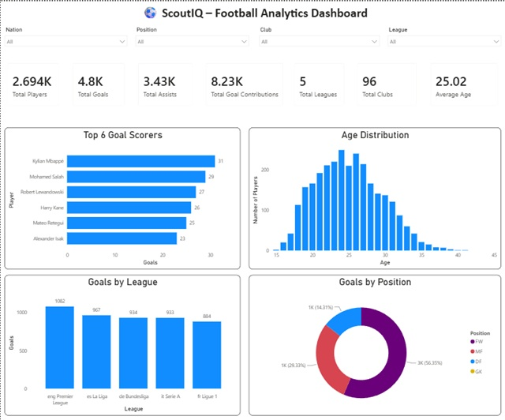
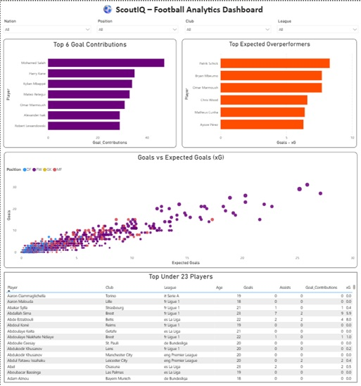
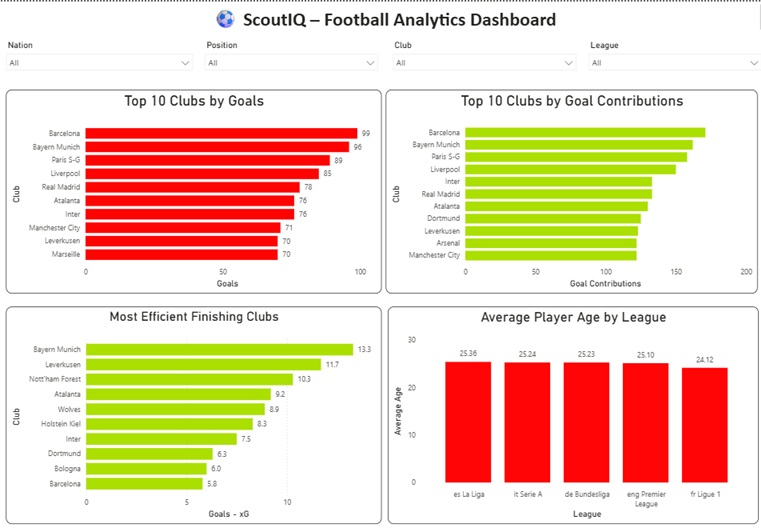

# ⚽ ScoutIQ – Football Analytics Dashboard

An interactive football analytics dashboard built using **Power BI, DAX, and Power Query** to analyze player performance, club statistics, and league trends across Europe's top five football leagues.

ScoutIQ transforms raw football data into meaningful insights through interactive dashboards, KPI tracking, and analytical visualizations to help understand player and team performance.

---

# 📊 Dashboard Preview

## Executive Dashboard



---

## Player Performance Analysis



---

## Club Analysis



---

# 🚀 Dashboard Features

## 📌 Executive Dashboard

Provides a high-level overview of football performance metrics:

- Total players analyzed
- Total goals and assists
- Total goal contributions
- Number of clubs and leagues
- Average player age
- Top goal scorers
- Goals distribution across leagues
- Position-wise goal contribution analysis
- Player age distribution


---

## 📌 Player Performance Analysis

Focuses on individual player evaluation:

- Top players by goal contributions
- Goals vs Expected Goals (xG) analysis
- Identifying xG overperformers
- Under-23 player analysis
- Player performance comparison
- Advanced metrics:
  - Goals per 90
  - Assists per 90
  - Expected Goals (xG)
  - Expected Assists (xAG)


---

## 📌 Club & League Analysis

Analyzes team-level performance:

- Top clubs by goals scored
- Top clubs by goal contributions
- Finishing efficiency analysis using Goals - xG
- Average player age comparison across leagues
- Club attacking performance comparison


---

# 🛠️ Technologies Used

- **Microsoft Power BI**
- **DAX (Data Analysis Expressions)**
- **Power Query**
- **Data Cleaning**
- **Data Transformation**
- **Data Modeling**
- **Data Visualization**


---

# 📈 Key Insights Generated

Some insights explored through the dashboard:

- Identified top-performing players based on goals and total goal contributions.
- Compared actual goals scored against expected goals (xG) to evaluate finishing efficiency.
- Analyzed attacking strength of clubs across Europe's top leagues.
- Studied player age distribution and positional trends.
- Compared club performance using advanced football metrics.


---

# 📂 Project Structure

```
ScoutIQ-Football-Analytics-Dashboard/

│
├── data/
│   ├── raw/
│   │   └── Original football dataset
│   │
│   └── processed/
│       ├── Cleaned dataset
│       └── Final dataset used for analysis
│
├── images/
│   ├── executive_dashboard.jpg
│   ├── player_analysis.jpg
│   └── club_analysis.jpg
│
├── power BI/
│   └── ScoutIQ.pbix
│
├── README.md
│
└── .gitignore
```

---

# 🎯 Skills Demonstrated

Through this project, I worked on:

- Business Intelligence Reporting
- Data Visualization
- Dashboard Design
- Data Cleaning and Transformation
- DAX Calculations
- Interactive Filtering
- Analytical Storytelling
- Sports Analytics


---

# 🔍 Future Improvements

Potential improvements for future versions:

- Add live football data refresh
- Add player scouting recommendations
- Create advanced player ranking models
- Integrate machine learning-based performance prediction
- Deploy dashboard using Power BI Service


---

# 👨‍💻 Author

**Akshat Singh Rawat**

GitHub:
https://github.com/akshatsinghrawat


---

⭐ If you found this project interesting, feel free to connect and share feedback.
