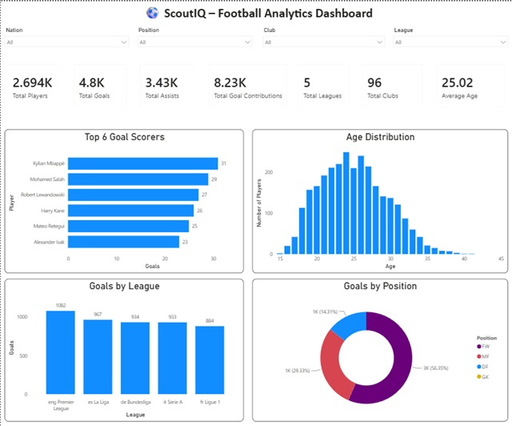
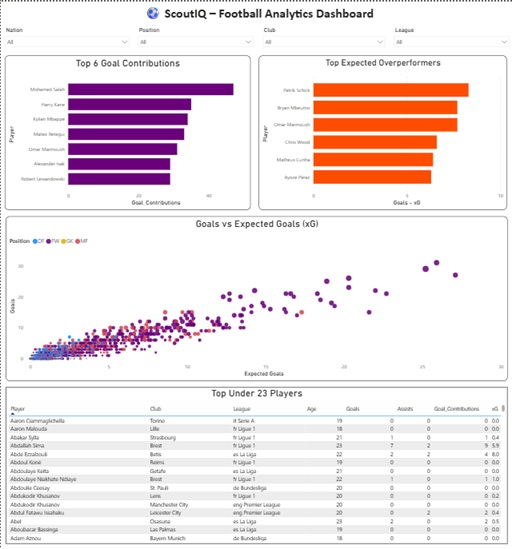
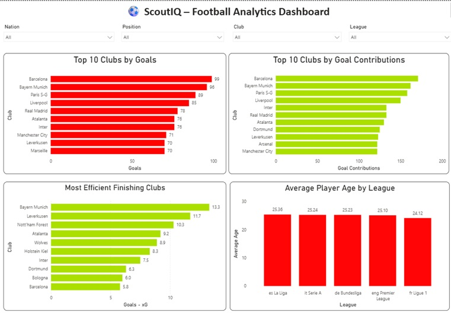

# ⚽ ScoutIQ

### Football Player Scouting & Performance Analytics Platform

ScoutIQ is a football analytics and scouting project built to transform
player-level football statistics into actionable performance insights.
The project combines **Python, Pandas, MySQL, SQL, Streamlit, Plotly,
and Power BI** to support player analysis, comparison, filtering, and
position-aware scouting evaluation.

The project works with **2024--25 data from Europe's top five leagues**
and contains **2,846 player records and 171 columns in the final
processed dataset**.

------------------------------------------------------------------------

## 📌 Project Overview

ScoutIQ is designed around a simple question:

> **How can football player performance data be transformed into a
> practical scouting and comparison tool?**

The project follows an end-to-end analytics workflow:

``` text
Raw Football Data
        ↓
Data Cleaning
        ↓
Processed Dataset
        ↓
Feature Engineering
        ↓
 ┌───────────────┬────────────────┬─────────────────┐
 ↓               ↓                ↓
SQL / MySQL   ScoutIQ Scoring   Power BI
 ↓               ↓                ↓
Analysis      Player Evaluation  Dashboards
 └───────────────┴────────────────┴─────────────────┘
                        ↓
                  Streamlit App
                        ↓
              Scouting & Analysis
```

------------------------------------------------------------------------

## 🎯 Project Objectives

ScoutIQ focuses on:

-   Exploring player performance across Europe's top five leagues
-   Cleaning and preparing football performance data
-   Creating derived football analytics metrics
-   Performing player, club, and league analysis using SQL
-   Comparing players across multiple performance dimensions
-   Creating a position-specific **ScoutIQ Score**
-   Building interactive Power BI dashboards
-   Building a Streamlit application for player search, comparison, and
    exploration
-   Turning raw statistics into a more practical scouting workflow

------------------------------------------------------------------------

# 📊 Dataset

### Dataset

The project uses a 2024--25 football player statistics dataset covering:

-   Premier League
-   La Liga
-   Bundesliga
-   Serie A
-   Ligue 1

### Dataset progression

  Stage                Rows   Columns
  ----------------- ------- ---------
  Raw dataset         2,854       165
  Cleaned dataset     2,846       165
  Final dataset       2,846       171

The final dataset therefore contains **6 engineered features** in
addition to the original 165 columns.

> Note: The dataset contains player-level records associated with
> clubs/competitions, so the number of rows is not identical to the
> number of unique player names.

------------------------------------------------------------------------

## 📋 Major Data Categories

The dataset contains a broad range of football performance information,
including:

### Player information

-   Player
-   Nation
-   Position
-   Club
-   Competition
-   Age
-   Birth year

### Playing time

-   Matches
-   Starts
-   Minutes
-   90s played

### Attacking

-   Goals
-   Assists
-   Goal contributions
-   Penalties
-   Shots
-   Shots on target

### Expected metrics

-   xG
-   npxG
-   xAG
-   npxG + xAG

### Passing

-   Passes completed
-   Pass attempts
-   Pass completion %
-   Key passes
-   Progressive passes
-   Passes into the penalty area

### Defending

-   Tackles
-   Interceptions
-   Clearances
-   Blocks
-   Tackles won

### Chance creation

-   Shot-creating actions (SCA)
-   Goal-creating actions (GCA)

### Possession

-   Touches
-   Carries
-   Progressive carries
-   Progressive receptions

### Goalkeeping

-   Goals against
-   Saves
-   Save %
-   Clean sheets
-   Clean-sheet %
-   Post-shot expected goals
-   PSxG+/-

------------------------------------------------------------------------

# 🧹 Data Preparation

The project separates the data workflow into:

``` text
data/raw/
      ↓
data/processed/players_data_cleaned.csv
      ↓
Feature Engineering
      ↓
data/processed/players_final.csv
```

The final dataset is the main dataset consumed by the Streamlit
application and imported into MySQL.

------------------------------------------------------------------------

# 🧮 Feature Engineering

The project creates six additional features.

## 1. Goal Difference

``` text
Goal_Difference = Goals - xG
```

This measures how far a player's actual goals are above or below their
expected goals.

Example:

``` text
Goals = 15
xG = 10

Goal Difference = +5
```

------------------------------------------------------------------------

## 2. Goal Contributions

``` text
Goal_Contributions = Goals + Assists
```

This provides a simple measure of a player's direct attacking
contribution.

------------------------------------------------------------------------

## 3. Goals per 90

``` text
Goals_per90 = (Goals / Minutes) × 90
```

Per-90 metrics make player production more comparable when players have
different amounts of playing time.

------------------------------------------------------------------------

## 4. Assists per 90

``` text
Assists_per90 = (Assists / Minutes) × 90
```

------------------------------------------------------------------------

## 5. Goal Contributions per 90

``` text
GC_per90 = (Goal Contributions / Minutes) × 90
```

------------------------------------------------------------------------

## 6. Finishing Efficiency

``` text
Finishing_Efficiency = Goals / xG
```

The implementation only calculates this when xG is greater than zero,
avoiding division by zero.

------------------------------------------------------------------------

# ⭐ ScoutIQ Scoring System

One of the main analytical components of the project is a custom
**ScoutIQ Score**.

Instead of evaluating every player using the same statistics, the
scoring system uses different metrics and weights for different primary
positions.

### Minimum playing-time threshold

A player must have at least:

``` text
900 minutes
```

to qualify for a ScoutIQ Score.

This reduces the influence of very small samples.

------------------------------------------------------------------------

## ⚽ Forward Scoring

  Metric                        Weight
  --------------------------- --------
  Goals per 90                     35%
  Assists per 90                   15%
  Goal Contributions per 90        20%
  SCA90                            15%
  GCA90                            15%

------------------------------------------------------------------------

## 🎯 Midfielder Scoring

  Metric                        Weight
  --------------------------- --------
  Assists per 90                   20%
  Goal Contributions per 90        15%
  SCA90                            25%
  GCA90                            20%
  Pass Completion %                20%

------------------------------------------------------------------------

## 🛡️ Defender Scoring

  Metric                        Weight
  --------------------------- --------
  Tackles per 90                   25%
  Interceptions per 90             25%
  Clearances per 90                20%
  Pass Completion %                15%
  Goal Contributions per 90        15%

------------------------------------------------------------------------

## 🧤 Goalkeeper Scoring

  Metric            Weight
  --------------- --------
  Save %               45%
  Clean Sheet %        30%
  PSxG+/-              25%

------------------------------------------------------------------------

## How the ScoutIQ Score works

The scoring process is:

``` text
Player Position
       ↓
Check 900-minute qualification
       ↓
Select position-specific metrics
       ↓
Calculate percentile within position group
       ↓
Multiply percentile by metric weight
       ↓
Sum weighted values
       ↓
Round final score
       ↓
ScoutIQ Score / 100
```

The score is calculated separately for forwards, midfielders, defenders,
and goalkeepers.

This prevents players from completely different positions from being
evaluated using the same performance framework.

### Methodological note

The current weights are manually defined in `scoring.py`. The project
does not currently contain a statistical optimization or historical
scouting-outcome validation process for these weights. A future version
could validate the weighting methodology using expert feedback,
historical outcomes, or statistical/ML techniques.

------------------------------------------------------------------------

# 🗄️ MySQL & SQL Analytics

The processed dataset is imported into a MySQL database named:

``` text
scoutiq
```

with the main table:

``` text
players
```

The project uses **Pandas + SQLAlchemy** for importing the processed CSV
into MySQL.

### SQL topics covered

The SQL analysis includes:

-   SELECT
-   WHERE
-   ORDER BY
-   LIMIT
-   DISTINCT
-   LIKE
-   BETWEEN
-   IN
-   Aggregate functions
-   GROUP BY
-   HAVING
-   CASE-style analytical logic where applicable
-   INNER JOIN
-   LEFT JOIN
-   Subqueries
-   Correlated subqueries
-   CTEs
-   ROW_NUMBER()
-   PARTITION BY
-   Window-function based ranking

------------------------------------------------------------------------

## SQL Analysis Examples

The project answers questions such as:

-   Who are the top goal scorers?
-   Who are the youngest players?
-   Which leagues contain the most players?
-   Which clubs score the most goals?
-   Which clubs have the highest goal contributions?
-   Which players have high goals per 90?
-   Which young players have high goal contributions?
-   Who are the top five goal scorers in each league?
-   Which players perform above their league average?
-   Which clubs have more than a specified number of young players?

### Example: Top 10 goal scorers

``` sql
WITH RankedPlayers AS
(
    SELECT Player,
           Squad,
           Gls,
           ROW_NUMBER() OVER(
               ORDER BY Gls DESC
           ) AS Goal_Rank
    FROM players
)

SELECT *
FROM RankedPlayers
WHERE Goal_Rank <= 10;
```

### Example: Top 5 goal scorers in every league

``` sql
WITH RankedPlayers AS
(
    SELECT Player,
           Squad,
           Comp,
           Gls,
           ROW_NUMBER() OVER(
               PARTITION BY Comp
               ORDER BY Gls DESC
           ) AS League_Rank
    FROM players
)

SELECT *
FROM RankedPlayers
WHERE League_Rank <= 5;
```

------------------------------------------------------------------------

# 📈 Power BI Dashboard

The project also contains a Power BI dashboard:

``` text
power BI/ScoutIQ.pbix
```

The dashboard is organized around three analytical areas.

## 1. Executive Dashboard

Provides a high-level overview of:

-   Total players
-   Total goals
-   Total assists
-   Total goal contributions
-   Number of clubs
-   Number of leagues
-   Average player age
-   Top goal scorers
-   Goals by league
-   Age distribution
-   Position-wise performance



------------------------------------------------------------------------

## 2. Player Performance Analysis

Focuses on player-level performance through:

-   Goal contributions
-   Goals vs xG
-   Player over/under-performance relative to xG
-   Under-23 analysis
-   Player performance comparison
-   Goals per 90
-   Assists per 90
-   xG
-   xAG



------------------------------------------------------------------------

## 3. Club & League Analysis

Focuses on team and competition-level performance:

-   Top clubs by goals
-   Top clubs by goal contributions
-   Finishing efficiency using Goals - xG
-   Average player age by league
-   Club attacking performance



------------------------------------------------------------------------

# 🖥️ Streamlit Application

ScoutIQ also includes an interactive Streamlit application.

Run the application from the project root with:

``` bash
streamlit run app.py
```

The application contains three main analytical pages.

------------------------------------------------------------------------

## 🔍 Player Search

The Player Search page allows users to:

-   Select a player-club record
-   View the player's ScoutIQ Score
-   View club, position, age, and league
-   View goals, assists, goal contributions, minutes, and xG
-   View a performance breakdown
-   View a per-90 performance radar

The ScoutIQ scoring function is applied directly to the processed
dataset.

------------------------------------------------------------------------

## ⚖️ Compare Players

The comparison page allows users to select two player-club records and
compare:

-   Club
-   Position
-   Age
-   League
-   Minutes
-   Goals
-   Assists
-   Goal contributions
-   xG
-   xAG
-   Shots
-   Shots on target
-   Pass completion %
-   Key passes
-   Tackles
-   Interceptions
-   Goals per 90
-   Assists per 90

It also provides an interactive radar-chart comparison using Plotly.

------------------------------------------------------------------------

## 🧭 Explore Players

The Explore Players page acts as a filtering and shortlist tool.

Users can filter by:

-   League
-   Position
-   Club
-   Age range
-   Minimum minutes
-   Minimum goal contributions

Users can also:

-   Choose position matching behavior
-   Sort by selected metrics
-   View filtered players
-   Export the filtered results as CSV

This creates a practical workflow for narrowing a large player dataset
into a scouting shortlist.

------------------------------------------------------------------------

# 🧰 Tech Stack

  -----------------------------------------------------------------------
  Technology                          Purpose
  ----------------------------------- -----------------------------------
  Python                              Data processing, feature
                                      engineering, scoring, application
                                      logic

  Pandas                              Data manipulation and analysis

  NumPy                               Numerical calculations and
                                      conditional feature creation

  Streamlit                           Interactive scouting application

  Plotly                              Interactive charts and radar
                                      visualizations

  MySQL                               Relational database for player data

  SQLAlchemy                          Python-to-MySQL database
                                      connection/import

  SQL                                 Player, club, and league analysis

  Power BI                            Interactive analytical dashboards

  Power Query                         Data transformation within Power BI

  DAX                                 Power BI analytical calculations

  Jupyter Notebook                    Data preparation and
                                      feature-engineering workflow
  -----------------------------------------------------------------------

------------------------------------------------------------------------

# 📂 Project Structure

``` text
Scout IQ/
│
├── app.py
├── scoring.py
├── import_to_mysql.py
├── requirements.txt
├── README.md
├── .gitignore
│
├── data/
│   ├── raw/
│   │   └── players_data_light-2024_2025.csv
│   │
│   └── processed/
│       ├── players_data_cleaned.csv
│       └── players_final.csv
│
├── notebooks/
│   ├── 01_data_loading.ipynb
│   ├── 02_data_cleaning.ipynb
│   ├── 03_exploratory_data_analysis.ipynb
│   └── 04_feature_engineering.ipynb
│
├── pages/
│   ├── 1_Player_Search.py
│   ├── 2_Compare_Players.py
│   └── 3_Explore_Players.py
│
├── SQL/
│   ├── 01_database_setup.sql
│   ├── 02_basic_queries.sql
│   ├── 03_aggregate_analysis.sql
│   ├── 04_window_function.sql
│   └── 05_joins.sql
│
├── power BI/
│   └── ScoutIQ.pbix
│
└── images/
    ├── executive_dashboard.jpg
    ├── player_analysis.jpg
    └── club_analysis.jpg
```

------------------------------------------------------------------------

# 🚀 Setup

## 1. Clone the repository

``` bash
git clone <your-repository-url>
cd "Scout IQ"
```

## 2. Create a virtual environment

``` bash
python -m venv venv
```

Activate it on Windows:

``` bash
venv\Scripts\activate
```

## 3. Install dependencies

``` bash
pip install -r requirements.txt
```

The main Python dependencies are:

``` text
streamlit
pandas
numpy
plotly
```

## 4. Run the Streamlit application

``` bash
streamlit run app.py
```

------------------------------------------------------------------------

# 🗃️ MySQL Setup

Create the database:

``` sql
CREATE DATABASE scoutiq;
```

The project contains SQL scripts for:

1.  Database setup
2.  Basic analysis
3.  Aggregate analysis
4.  Window-function analysis
5.  JOINs and advanced queries

The Python import script uses SQLAlchemy to load `players_final.csv`
into the `players` table.

### Security note

Database credentials should **not** be committed directly into source
code.

For a production implementation, credentials should be stored using
environment variables or a secrets-management system.

------------------------------------------------------------------------

# 💡 Key Analytical Concepts

ScoutIQ demonstrates practical use of:

### Data Analytics

-   Data cleaning
-   Exploratory analysis
-   Feature engineering
-   Descriptive statistics
-   Performance comparison

### SQL

-   Filtering
-   Aggregation
-   Grouping
-   Joins
-   Subqueries
-   CTEs
-   Window functions
-   Ranking

### Football Analytics

-   Goals and assists
-   Goal contributions
-   Goals per 90
-   Assists per 90
-   xG
-   xAG
-   SCA/GCA
-   Finishing performance
-   Position-specific evaluation

### Business Intelligence

-   KPI design
-   Interactive dashboards
-   Filtering
-   Comparative analysis
-   Analytical storytelling

------------------------------------------------------------------------

# ⚠️ Current Limitations

ScoutIQ is a project-level analytics platform rather than a production
scouting system.

Current limitations include:

-   The dataset is based on a fixed 2024--25 dataset rather than a live
    data feed.
-   The ScoutIQ scoring weights are manually defined.
-   The scoring methodology has not been statistically optimized against
    historical scouting outcomes.
-   Player records can represent club/competition-level records rather
    than unique individuals.
-   The current Streamlit application reads the processed CSV directly.
-   The current MySQL import process replaces the target table when
    rerun.
-   Database credentials in the import script should be moved to
    environment variables before public/production use.
-   The dedicated `04_window_function.sql` file is currently empty;
    window-function examples are present in `05_joins.sql`.
-   The project does not currently demonstrate automated model
    validation or a machine-learning-based scouting recommendation
    engine.

These limitations provide clear directions for future development.

------------------------------------------------------------------------

# 🔮 Future Improvements

Potential future improvements include:

### Data

-   Automated data ingestion
-   Live football data APIs
-   Scheduled data refresh
-   More seasons
-   More competitions

### Scouting

-   Expert-validated scoring weights
-   Similar-player recommendations
-   Advanced player ranking
-   Position-specific benchmarking
-   Player suitability scores for specific clubs
-   Recruitment shortlists

### Analytics

-   Predictive performance models
-   Machine learning
-   Player development trends
-   Transfer-value analysis
-   Team tactical analysis

### Engineering

-   Production database architecture
-   Environment-based configuration
-   Automated ETL pipeline
-   API layer
-   Authentication
-   Cloud deployment
-   Application monitoring

### BI

-   Automated Power BI refresh
-   Power BI Service deployment
-   Additional dashboard pages
-   More advanced DAX measures
-   Interactive scouting reports

------------------------------------------------------------------------

# 🎓 Skills Demonstrated

Through ScoutIQ, the project demonstrates practical experience with:

-   Python
-   Pandas
-   NumPy
-   SQL
-   MySQL
-   SQLAlchemy
-   Streamlit
-   Plotly
-   Power BI
-   DAX
-   Power Query
-   Data Cleaning
-   Feature Engineering
-   Exploratory Data Analysis
-   Data Visualization
-   Database Analysis
-   Window Functions
-   Business Intelligence
-   Sports Analytics
-   Analytical Storytelling

------------------------------------------------------------------------

# 📌 Project Highlights

### Data

``` text
2,854 raw records
        ↓
2,846 cleaned records
        ↓
171 final columns
```

### Feature Engineering

``` text
6 additional analytical features
```

### SQL

``` text
Basic queries
Aggregations
Subqueries
CTEs
Window functions
JOINs
```

### Scouting

``` text
4 position groups
Position-specific metrics
900-minute qualification threshold
Percentile-based weighted score
```

### Applications

``` text
Streamlit
 ├── Player Search
 ├── Compare Players
 └── Explore Players

Power BI
 ├── Executive Dashboard
 ├── Player Analysis
 └── Club Analysis
```

------------------------------------------------------------------------

# 👨‍💻 Author

**Akshat Singh Rawat**

Football Analytics & Player Scouting Project

------------------------------------------------------------------------

## ⭐ About ScoutIQ

ScoutIQ demonstrates how a football dataset can be transformed from raw
player statistics into a complete analytics workflow combining **data
preparation, feature engineering, SQL analysis, custom player
evaluation, interactive application development, and business
intelligence dashboards**.

The project is intended as an analytical/scouting prototype and provides
a foundation for future development into a more automated and
data-driven recruitment platform.
